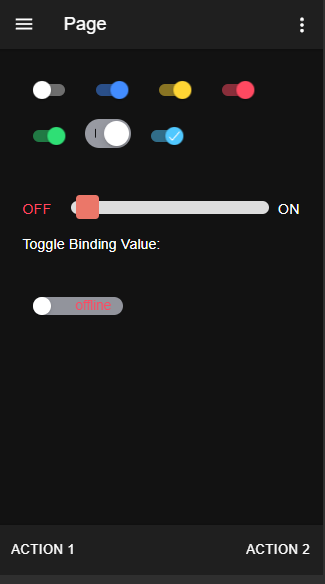

#  toggle

How to use toggle.

<i>Connectors</i>
<blockquote>

##  void

void connector, replace or don't use it

<i>Transactions</i>
<blockquote>

###  void

does nothing

</blockquote>

</blockquote>

<i>Mobile Application</i>
<blockquote>

##  Application

NGX Toggle usage and theming.

<i>Pages</i>
<blockquote>

###  Page

<ul>
<li>Basic toggles On/Off and color, iOS/MD mode and [enableOnOffLabels] property</li>
<li>Theming toggle with text, color change and binding.</li>
<li>Text inside toggle.</li>
</ul>
 

</blockquote>

</blockquote>

