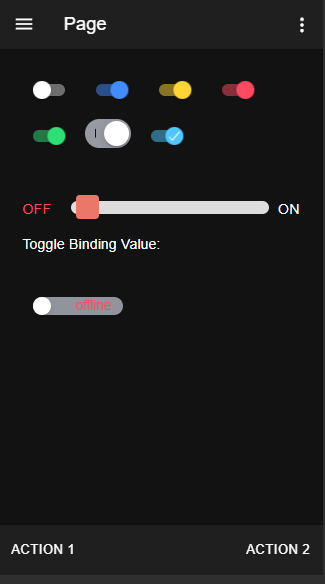

# toggle

How to use toggle.


For more technical informations : [documentation](./project.md)

- [Installation](#installation)
- [Mobile Application](#mobile-application)
    - [Pages](#pages)
        - [Page](#page)


## Installation

1. In your Convertigo Studio use `File->Import->Convertigo->Convertigo Project` and hit the `Next` button
2. In the dialog `Project remote URL` field, paste the text below:
   <table>
     <tr><td>Usage</td><td>Click the copy button</td></tr>
     <tr><td>To contribute</td><td>

     ```
     toggle=C:/Convertigo/Studio 8.1.0/workspace/toggle/.git:branch=master
     ```
     </td></tr>
     <tr><td>To simply use</td><td>

     ```
     toggle=C:/Convertigo/Studio 8.1.0/workspace/toggle//archive/master.zip
     ```
     </td></tr>
    </table>
3. Click the `Finish` button. This will automatically import the __toggle__ project


## Mobile Application

NGX Toggle usage and theming.

### Pages

#### Page

<ul>
<li>Basic toggles On/Off and color, iOS/MD mode and [enableOnOffLabels] property</li>
<li>Theming toggle with text, color change and binding.</li>
<li>Text inside toggle.</li>
</ul>
<br/>



